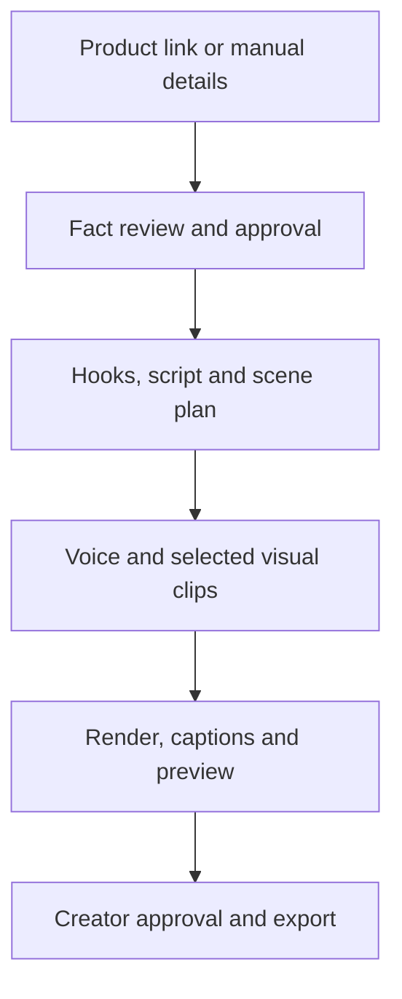

# AI Creation Platform — Project Brief

**Working title:** AI Creation Platform (brand name to be decided)  
**First product:** Marketing → Affiliate Studio  
**Second product:** Entertainment → Entertainment Studio (decided 26 September 2026, R27; specified in Product Specification §3.23)  
**Long-term scope:** Video creation for any genre or purpose  
**Status:** Planning draft  
**Last updated:** 26 September 2026

## 1. Product summary

Build a web platform that helps creators turn a real product into an original, short affiliate video. A creator provides a product link or enters product details, confirms what the product actually does, selects an audience and angle, reviews an AI-written script, generates a voiceover and short visual clips, edits the result, then exports a vertical video.

Affiliate Studio is the first product under **Marketing**. The platform is intended to support video creation across any genre or purpose: marketing, entertainment, education, personal stories, business communication and future categories shaped by user demand. These are examples, not a fixed list. The parent brand, account system, media library, AI providers, rendering pipeline and editor should be reusable across these workflows. The first release should solve one complete affiliate workflow before expanding.

**Core promise:** Create affiliate videos from product facts, with editable scripts and several testable hooks.

### Project objective

Create a flexible AI video platform that helps people plan, generate, edit and export videos for any creative or practical purpose. Its first product, Affiliate Studio, lets an individual creator go from product information to an editable, exportable affiliate video in one guided workspace. The platform should reduce the effort of ideation, scripting, voiceover and assembly while keeping the creator in control of the final output. Reuse the core tools for future video workflows without tying the parent platform to affiliate content or a predefined set of genres.

**Primary outcome for the first release:** A creator can enter a product manually, approve its facts, produce at least three distinct hooks, edit one complete script, assemble a video using their own assets and AI voice, review the result, and export a 9:16 MP4. Optional AI-generated scenes should enhance this flow without being required to finish it.

**Product principles:** Every generation remains editable; individual scenes can be regenerated; costs and job status are visible; a failed provider call never destroys approved work. Workflows add their own review steps where needed: Affiliate Studio requires approval of product claims, while another video workflow may require source review, character consistency or music rights.

## 2. Audience and problem

**Initial audience:** Small TikTok Shop and Shopee affiliate creators, starting with creators making English, Filipino or mixed-language short videos. Platform-specific publishing and data access depend on each platform's permissions and terms.

**Problem:** Creators spend time researching a product, deciding what to say, recording a voiceover, finding visuals, editing captions and making variants. Generic AI video tools produce clips, but do not connect these steps to a product's actual features or help creators compare different angles.

**Desired result:** A creator can make and export a usable 20–40 second draft from approved product facts and supplied images, then change the hook or regenerate individual scenes without rebuilding the entire video.

## 3. Product structure and long-term scope

The platform is a **general AI video creation workspace**. A studio is a guided workflow for a particular goal, while shared tools handle the work common to all videos. The areas below illustrate possible expansion; new genres can be introduced without changing the parent brand.

| Area | Example studios or videos | Timing |
| --- | --- | --- |
| Marketing | Affiliate videos, ads, product demos, social campaigns | Affiliate Studio first; others later |
| Entertainment | Short stories in a genre: drama, action, comedy, romance, horror, mystery, fantasy, slice of life | **Entertainment Studio, second (26 Sep 2026, R27)** |
| Education | Explainers, tutorials, lessons, training videos | Possible future expansion |
| Business and personal | Presentations, announcements, event recaps, invitations, personal stories | Possible future expansion |
| New categories | Any further genre or format creators need | Add based on demand |
| Shared platform | Accounts, projects, media, scripts, voice, scene timeline, generation jobs, editor and exports | Build around the first studio; reuse in later studios |

Keep the parent brand broad. **Affiliate Studio** is the first studio, not the platform name. **Entertainment Studio** is the second (decided 26 September 2026): a creator picks a genre, a premise and a cast, and the shared script, media, voice, editor and export tools make the story, with no product, affiliate link or fact review. The goal is not to build every example above.

Each studio supplies its own intake fields, script prompts, generation options, review rules and export presets. The shared project and media system should not require a product listing, affiliate link or approved product fact to create a non-affiliate video. A general **New Video** entry point can be added when a second workflow is ready.

## 4. MVP scope

### Required for a private beta

1. Account login and a dashboard of saved projects.
2. Create an affiliate project from a product URL **or** manual product entry. URL import is a convenience; manual entry must always work.
3. Upload and organize product photos or clips that the creator has rights to use.
4. Show extracted or entered facts with their sources; require the creator to review claims before generation.
5. Select target audience, platform, language, tone, selling angle and target duration.
6. Generate multiple hook options, one editable script, a scene plan, on-screen text, CTA and caption.
7. Generate a voiceover from the approved script; let the creator preview and replace it.
8. Build a draft from real product assets, text, captions and transitions. Add short AI-generated scenes if an API integration is available and approved for this use.
9. Preview, edit scene order/text/voice, regenerate one scene, and export a 9:16 MP4.
10. Save project state, show generation progress and failures, and allow retries without duplicate charges or jobs.

### Explicitly outside the first release

- Automatic posting to TikTok, Shopee, Instagram or YouTube.
- Automated sales attribution or commission reporting.
- Scraping restricted pages or bypassing access controls to import a product.
- Full AI generation of every second of the finished video.
- AI presenters, face cloning, voice cloning and a full multitrack editor.
- Guaranteed sales, compliance certification or a promise that AI will preserve every product detail.

## 5. Main user journey

1. **Create project:** Enter a product URL or manually add title, description, price if relevant, images, features and link.
2. **Review facts:** See each claim alongside its source. Correct, remove or approve it; mark unknown attributes as unknown.
3. **Choose direction:** Pick audience, platform, language, style, duration and one selling angle. The app suggests alternative hooks.
4. **Review script:** Edit hook, narration, on-screen text and CTA. Regenerate a hook or a scene without losing approved work.
5. **Choose media:** Map uploaded assets to scenes. Optionally request short image-to-video clips for specific scenes.
6. **Generate voice:** Pick a licensed voice, listen, edit pronunciation or wording, and regenerate if needed.
7. **Assemble and inspect:** Render a vertical draft. Review captions, timing, product appearance and factual claims.
8. **Export:** Download the MP4 and optionally a creator brief containing script, shot list and caption.

Project states: `draft → facts_review → script_review → media_review → generating → ready → exported`. A failed job returns to an editable state with a specific error and retry option.

## 6. Key screens

| Screen | Purpose |
| --- | --- |
| Dashboard | Recent projects, create button, status and exports |
| Product setup | URL/manual entry, asset upload, product information |
| Fact review | Claims, source references, edits and explicit approval |
| Strategy | Audience, angle, platform, language, style and hook options |
| Script Studio | Editable narration, CTA, shot list and on-screen text |
| Generate | Voice and video options, estimated usage, job progress |
| Editor/preview | Scene cards, preview, text and timing adjustments, replace asset |
| Export | Final review, MP4 download and creator brief |

### Detailed feature requirements

**1. Accounts and project dashboard**

- Users can sign in, create a project, rename it, duplicate it and reopen work in progress.
- Each project card shows its product name, last edit, stage, thumbnail and latest export.
- An empty dashboard explains the first action: add a product to create a video.

**2. Product setup and asset library**

- Accept a product URL when permitted, or manual title, category, description, affiliate URL and images. Do not block the flow if importing fails.
- Show exactly which fields came from the URL and which were entered by the user. Allow corrections before AI writing begins.
- Support upload of original product images and short footage. Show asset previews, file validation, progress, removal and replacement.
- Save uploads once per project so later script or scene versions can reuse them.

**3. Fact review and claim control**

- Present each proposed feature or claim as a separate editable row with its source and status: `unreviewed`, `approved` or `rejected`.
- Let the creator add a missing fact, correct an imported claim or mark information as unknown.
- Feed approved facts only into generation. Prevent unsupported performance, health, price or availability claims from being silently introduced.
- Show a review reminder before export for any newly introduced claim or visual implication.

**4. Audience and creative strategy**

- Collect the intended buyer, main problem, desired benefit, platform, language, tone, approximate duration and content style.
- Suggest several distinct selling angles, such as a practical use case, a feature demonstration or a problem/solution story, grounded in approved facts.
- Let the creator choose an angle or write their own, then save that choice with the script version.

**5. Hooks and Script Studio**

- Generate at least three clearly different hook options and explain the opening visual for each.
- Generate an editable narration script broken into scenes, each with a purpose, proposed duration, on-screen text, suggested visual and CTA where appropriate.
- Display an approximate spoken duration and warn when the narration is too long for the chosen video length.
- Let the creator edit any field, regenerate only a hook or scene, restore an earlier script version and approve the selected version.
- Produce a plain-text creator brief containing the approved hook, script, shot list, caption and product link.

**6. Voice Studio**

- Offer a small set of permitted voices and preview samples before spending credits on a full voiceover.
- Generate from approved narration only; allow pronunciation edits and replacement of the generated track.
- Let the creator upload their own narration instead. Keep the voice track linked to the script version it reads.
- Display voice job progress and a clear error if a provider rejects or times out on a request.

**7. Scene planning and AI video**

- Represent the video as ordered scene cards with duration, visual source, prompt, on-screen text and audio section.
- Default to creator-provided product media. Offer image-to-video generation on eligible scene cards when the integration is enabled.
- Show the input image and estimated usage before submission. Store generated alternatives so the creator can compare, select or discard them.
- Permit regeneration of one scene without rerunning voice or other accepted scenes. Require review of any AI depiction of the actual product.

**8. Captions, editor and preview**

- Automatically create captions from voice timing or audio alignment. Allow wording and line-break corrections.
- Let creators reorder scenes, replace images/clips, change on-screen text, adjust a limited set of scene durations and choose from a few readable caption styles.
- Preview the whole video before export, including audio, captions and end card. Keep editing controls simple for the first version.
- Provide a licensed or user-uploaded music option only when its use rights are clear; control music level against voice.

**9. Export and reuse**

- Export an MP4 in a vertical 9:16 preset, with a viewable thumbnail and downloadable creator brief.
- Save export history with the script, assets and settings used for each result.
- Allow the creator to duplicate a project to test another hook while keeping the original finished version.
- Leave direct platform posting and automated performance imports for later releases.

**10. Generation status and usage**

- Show `queued`, `running`, `completed` and `failed` for voice, scene and render jobs; let users leave and return while jobs continue.
- Estimate usage before a paid generation, prevent accidental duplicate requests and show the actual credits or usage after completion.
- When a job fails, preserve all earlier edits and offer a targeted retry with an understandable explanation.

## 7. AI and media workflow



**Script:** Use one text model initially. For Affiliate Studio, send approved facts, creative settings and a structured output schema. Generate several distinct hooks and one script at a time. Future studios can supply other inputs and output schemas, such as a story outline or lesson plan. Keep provider calls behind a small adapter so another model can be tested later.

**Video:** Use actual product photos and footage for scenes where product accuracy matters. Generate optional 3–6 second image-to-video B-roll shots with restrained motion. Review every generated frame sequence for changed packaging, buttons, colors and implied capabilities. Keep generation prompts, seeds where supported, input asset IDs and provider job IDs for repeatability and troubleshooting.

**Voice:** Generate speech from the approved narration. Use the provider's timing output when available; otherwise align captions with an audio transcription or forced-alignment step. Do not assume Whisper is needed if reliable word timing already exists.

**Render:** Assemble approved visuals, voice, music with an appropriate license, captions and optional CTA using FFmpeg or Remotion. Export a vertical MP4 for Affiliate Studio. The shared renderer should accept other aspect ratios and video structures as future studios need them. Rendering should be possible without any generated video clips, using uploaded assets and motion graphics.

## 8. Provider decisions

| Need | Prototype choice | Product integration decision |
| --- | --- | --- |
| Script and hooks | OpenAI API with a low-cost text model such as GPT-6 Luna | Start with one provider; measure quality and cost before adding Claude |
| Voice | ElevenLabs paid plan for manual voice tests | Use its API with the appropriate commercial plan and track credits per job |
| Video | Hailuo subscription for **manual** concept testing | Verify an authorized video API, its separate price, rate limits and rights before enabling in-app generation; MiniMax is a candidate |
| Assembly | FFmpeg or Remotion | Run in an isolated worker, not in a page request |
| Storage | Local development storage | S3-compatible object storage for uploaded, intermediate and final files |

**Important purchasing distinction:** A creator subscription to a video website is not an API entitlement for a SaaS. The earlier rough **Hailuo + ElevenLabs subscription total** is a manual prototyping budget, **not** the operating cost of an automated web app. OpenAI API usage is billed separately from ChatGPT subscriptions. Verify current provider terms, prices, output rights, and whether creator accounts may be used to serve end users before purchase or launch.

## 9. Suggested technical architecture

| Layer | Suggested implementation | Responsibility |
| --- | --- | --- |
| Web app | Next.js, React, TypeScript | Projects, review flows, preview and editor |
| API | NestJS, TypeScript | Authentication, projects, quotas, provider orchestration |
| Database | PostgreSQL | Users, facts, scripts, scenes, jobs, usage, exports |
| Queue | BullMQ + Redis | Slow video, voice and render jobs; retries and concurrency limits |
| Workers | Node.js workers with FFmpeg/Remotion | Provider polling, media processing and rendering |
| Files | S3-compatible object storage | Original assets, generated clips, audio, final MP4s |
| Providers | Server-side adapters | Text, speech and video APIs; credentials stay on the server |

Use a single repository or an Nx monorepo if shared types and deployment boundaries justify it. Start with one worker service and scale video workers separately when real usage demands it. Never hold an HTTP request open for a full video generation.

### Core entities

| Entity | Important fields |
| --- | --- |
| `User` | id, email, plan, created_at |
| `Project` | id, owner_id, studio_type, title, language, status, created_at; product_id is optional and affiliate-specific |
| `Product` | id, source_url, title, description, affiliate_link; used by Affiliate Studio |
| `ProductFact` | id, product_id, claim, source_type, source_reference, review_status; used by Affiliate Studio |
| `Asset` | id, project_id, type, storage_key, rights_status, metadata |
| `CreativeBrief` | id, project_id, goal, audience, style, duration, aspect_ratio, workflow_fields; affiliate angle/platform are workflow fields |
| `ScriptVersion` | id, project_id, hook, narration, CTA, caption, approval_status |
| `Scene` | id, script_version_id, order, duration, on_screen_text, asset_id, prompt |
| `GenerationJob` | id, project_id, type, status, provider, provider_job_id, idempotency_key, cost, error |
| `Export` | id, project_id, script_version_id, storage_key, format, created_at |

Keep project, script and scene versions so users can edit without losing an earlier approved result. Track which approved source facts fed affiliate scripts and which assets fed each export. Use typed, versioned workflow settings so later studios can add their own inputs without forcing every project into the product data model.

### Example API surface

- `POST /projects` — create a project.
- `POST /projects/:id/import-product` — try URL import; report unavailable fields clearly.
- `PUT /projects/:id/facts` — edit and approve facts.
- `POST /projects/:id/scripts` — request hooks, script and scene plan.
- `PUT /projects/:id/scripts/:versionId` — edit and approve a script.
- `POST /projects/:id/voice-jobs` — request voice generation.
- `POST /projects/:id/video-jobs` — request one scene clip.
- `POST /projects/:id/render-jobs` — render a preview or export.
- `GET /jobs/:id` — show status and errors.
- `GET /projects/:id/exports` — list completed exports.

Require authentication and ownership checks on every project and asset operation. Apply an idempotency key to generation requests so double clicks or retries do not create duplicate paid jobs.

## 10. Accuracy, rights and review rules

- **Fact provenance:** Keep the listing URL, creator input or other source next to every proposed claim. An imported listing is source material, not independent proof that a claim is true. The creator explicitly approves what can appear in the script.
- **Claim checks:** Flag unsupported superlatives, health outcomes, guarantees, invented testimonials, pricing or stock claims and visuals that suggest unconfirmed functionality. Show the reason and let the creator edit. Final human review remains required.
- **Product appearance:** Prefer original images or footage for close-ups, logos, controls and packaging. Treat generated clips as creative footage to inspect, not as a faithful product demonstration by default.
- **Assets and identity:** Ask users to confirm they can use uploaded images, music and voices. Avoid cloning a person's voice or likeness without their consent.
- **Platform rules:** Check current affiliate disclosures, synthetic-media labels, product claims and music rights for each destination platform before adding export presets or posting integrations.
- **Data and keys:** Keep API keys server-side, use signed URLs for private media, set retention/deletion rules, limit uploads, and record audit events for export and generation.

## 11. Cost controls and business model

Do not set customer pricing from subscription allowances for manual tools. Measure the actual **cost per successful exported video**, including rejected generations.

```text
cost per export = text calls + voice calls + video API calls
                + failed/retried calls + storage + rendering + delivery

gross margin = (revenue per export - cost per export) / revenue per export
```

Track by provider, model, resolution, seconds generated, retries and final exports. Put a quota and estimated credit usage in the UI before each paid video job. Cap clip count, duration, resolution, concurrency and retries; allow users to regenerate one scene instead of the full video. Decide plans and prices only after measuring real acceptance rates in a small beta.

Potential model: free or low-cost script drafting, with metered credits for voice, AI clips and exports. This is a hypothesis to validate, not a committed price list.

## 12. Delivery phases

| Phase | Deliverable | Exit condition |
| --- | --- | --- |
| 0. Validate workflow | Manually produce several affiliate samples with the candidate subscriptions | Creators judge the scripts and finished clips useful; record time and cost |
| 1. Script MVP | Accounts, projects, manual product input, fact review, strategy, scripts and brief export | Creators can make an approved creator brief without outside tools |
| 2. Video beta | Voice API, media upload, scene cards, captions, rendering and MP4 export | A creator can finish one video end to end inside the app |
| 3. AI video scenes | Authorized video API, queued jobs, scene replacement and cost controls | Short generated clips improve accepted exports at sustainable cost |
| 4. Learning loop | Variant labels, manually entered or permitted performance metrics | Creators can compare hooks and reuse the stronger angle |
| 5. Expansion | Entertainment Studio first (R27, Product Specification §3.23), then the next validated studio in any area, such as Education | Shared tools work with a workflow that has no affiliate product |

## 13. Definition of done for the first video beta

- A new user can create a project without a product URL and can complete the full flow with uploaded product assets.
- A user sees and approves every product claim before it enters a script.
- Hooks and narration are editable and stored as versions.
- Voice and render jobs show `queued`, `running`, `completed` or `failed` with useful error messages.
- A failed or repeated request does not silently create a second billable job.
- A user can replace an individual scene and export a playable 9:16 MP4 with readable captions and synchronized speech.
- The team can see provider usage, cost, generation failures and export completion for each project.

## 14. Questions to resolve through prototypes

1. Can the chosen product sources be imported reliably within their terms, or should manual entry remain the primary workflow?
2. Which voice sounds natural to the first audience in English, Filipino and mixed speech?
3. Does generated product footage add enough value to justify its rejection rate and API cost?
4. What percentage of first drafts do creators export, and which edits do they make most often?
5. Which destination platform should get the first specific caption, disclosure and export preset?
6. What provider terms, commercial rights and API limits apply to a user-facing SaaS at launch?

## 15. Success measures

- **Activation:** Percentage of new creators who finish fact review and generate a script.
- **Completion:** Percentage of started projects that produce an export.
- **Time to draft:** Median time from project creation to first preview.
- **Quality:** Percentage of exports accepted without replacing a generated product clip.
- **Economics:** Total provider and infrastructure cost per successful export, including retries.
- **Retention:** Percentage of creators who return to make another video or a new hook variant.

## 16. Official references to recheck before implementation

- [OpenAI API pricing and models](https://developers.openai.com/api/docs/pricing)
- [ElevenLabs plans](https://elevenlabs.io/pricing) and [API usage](https://help.elevenlabs.io/hc/en-us/articles/28184926326033-How-much-does-it-cost-to-use-the-API)
- [Hailuo subscription terms](https://hailuoai.video/doc/payment-policy.html)
- [MiniMax API platform](https://platform.minimaxi.com/)

Prices, access rules, model names and platform policies change. Confirm them when choosing a paid plan or connecting a production API.
