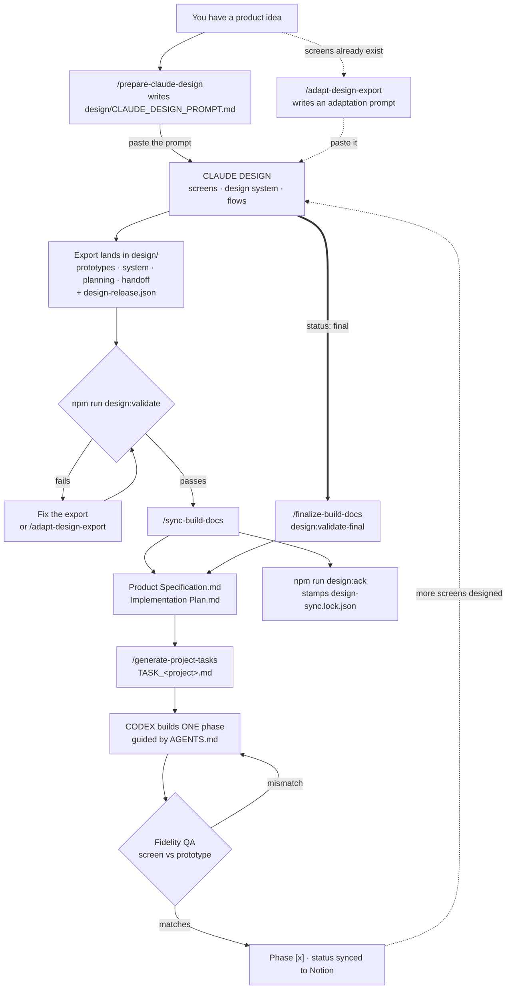
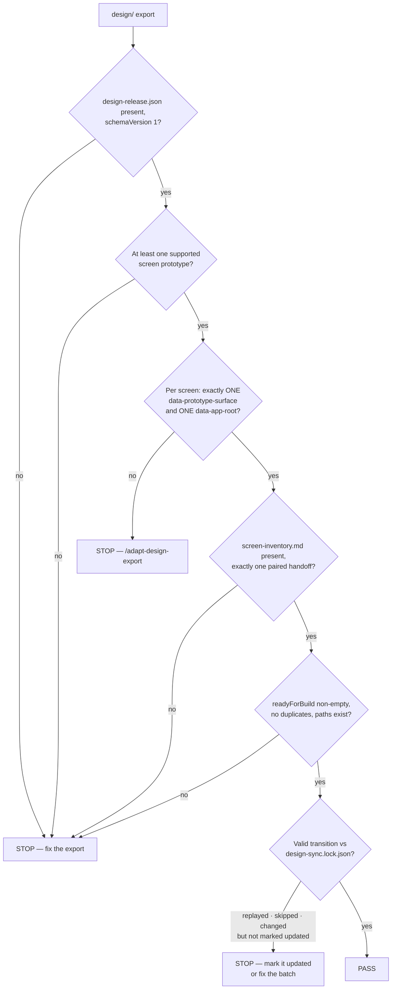

# How Claude Design works — beginner flow

A map of the whole design pipeline: who does what, which command runs when, what each
file is for, and what stops the line when something is wrong. For the visual version of
the same content, see the companion explainer artifact.

Run every command below in the **product repository** created from `app-boilerplate`,
never in the reusable boilerplate source repository.

## The analogy

The project is a building site.

| Piece | Role on site |
| --- | --- |
| Claude Design | The architect. Draws, never builds. |
| `design/` export | The sealed drawing tube delivered to site. |
| `npm run design:validate` | The building inspector at the gate. |
| `/sync-build-docs` | The foreman turning drawings into a work order. |
| `Product Specification.md` | The elevation drawings — how it must look. |
| `Implementation Plan.md` | The construction schedule — what gets built when. |
| Codex | The crew. Builds exactly to drawing, one phase at a time. |
| Claude Code | Foreman plus inspector. Plans, reviews, signs off rooms. |
| `AGENTS.md` + `.skills-source/` | The building code — same rules on every site. |
| Notion | The office wall board. Crew never writes on it. |

The point of the whole pipeline: the drawings are binding and machine-checkable, so
"the app looks a bit off" becomes something you can fail a gate on.

## The whole flow



Dotted lines are occasional paths. The loop at the bottom is the normal state of the
project — design a slice, build a slice, repeat. You do not wait for the whole app to be
designed before anyone writes code.

## Ownership boundaries

Most confusion here is really a question of *who owns this file*.

- **Claude Design owns `design/`**, including `design-release.json`.
- **The repository owns `design/design-sync.lock.json`.** Claude Design must never create
  or edit it.
- **Codex** ticks `[ ] → [~] → [x]` in the Implementation Plan and never edits Notion.
- **Claude Code** plans, reconciles, reviews, runs Fidelity QA, and syncs status to Notion.
  Per `CLAUDE.md`, it does not implement features unless explicitly asked.
- **Generated `AGENTS.md` is never edited directly** — fix the rule upstream in
  skills-source, advance `skills-source.lock.json`, regenerate.

## Stage by stage

### 01 — Write the brief

```text
/prepare-claude-design <project name>
```

Interviews you on the product problem, users and roles, target surfaces, MVP vs later
scope, brand, platform requirements, and constraints. Writes the self-contained
`design/CLAUDE_DESIGN_PROMPT.md` to paste into Claude Design. Never asks for secrets.

*On site: the client brief before the architect draws. Vague here costs a redesign later.*

### 01b — Adapt instead of restarting

```text
/adapt-design-export <project name>
```

If usable screens already exist in Claude Design — even with nothing exported — do not
overwrite them. This writes `design/CLAUDE_DESIGN_ADAPTATION_PROMPT.md`, which makes
Claude Design inventory its live screens, states, flows, and assets, then add the missing
handoff metadata while preserving design, copy, and interactions exactly.

*On site: the house is drawn but the title block and scale are missing. Annotate, don't redraw.*

### 02 — Import into authority-separated folders

```text
design/
├── prototypes/    screen--*.html, logo--*.html, *.dc.html
├── system/        tokens, typography, color, motion, voice
├── planning/      flows, IA, journeys, scope, PRD fragments
├── handoff/       [PROJECT] Design Reference.md
│                  [PROJECT] Design Handoff Plan.md
└── design-release.json
```

Every screen prototype declares its surface and its production boundary:

```html
<body data-prototype-surface="mobile">
  <div data-preview-shell>        <!-- phone frame, not shipped -->
    <main data-app-root>          <!-- THE CONTRACT -->
      ...actual application screen...
    </main>
  </div>
</body>
```

Everything inside `data-app-root` is binding. Device frames, browser chrome, desktop
centering canvases, and annotations stay outside it; presentation labels are marked
`data-handoff="presentation-only"`. Surfaces are `web`, `mobile`, `tablet`, or `desktop`.

The HTML is a **contract on outcomes, not source code**. Mobile is rebuilt with native
Expo/React Native primitives — real navigation, safe areas, keyboard behaviour, gestures,
sheets. Never a WebView, never copied DOM/CSS.

Do not rename prototype files to satisfy a convention; both named screen exports and
`*.dc.html` Design Component exports are supported.

### 03 — Declare a release, pass the inspection

```bash
npm run sync-skills      # hydrate the locked conventions
npm run check-skills     # generated AGENTS.md matches the lock
npm run design:validate  # the gate
```

Every export ships `design/design-release.json`, authored by Claude Design. It names the
project, `batch`, `revision`, and sorts screens into `readyForBuild`, `stillInDesign`,
`planned`, and `removedOrSuperseded`.

**Batch vs revision** is the number rule worth memorising: new ready scope increments
`batch`; a correction to already-released scope increments `revision`. Batch 1 is the
first coherent buildable slice, needs `previousBatch: 0`, and every screen in it must be
`added`. Prototype filenames stay stable — batch numbers never go in filenames.

What the gate checks:



The last check is the subtle one: the repository stores a hash of every accepted
prototype. Edit one and re-export it under the old batch/revision and the gate says
`design/<file> changed; mark it updated.`

*On site: the inspector keeps a photocopy of every drawing they approved.*

### 04 — Reconcile the release into build documents

```text
/sync-build-docs <project name>
```

On batch 1 it creates root `Product Specification.md` and `Implementation Plan.md`. Later
batches update the same files without resetting completed phase history. Only
`readyForBuild` screens become unblocked.

It stops and asks rather than inventing an answer on: a missing prototype, a missing or
duplicated production boundary, an unexplained planned screen, an ambiguous mapping of
boilerplate apps to product surfaces, or a material stack conflict. It confirms the
database **environment variable name** and a sanitized database name — never a connection
string, credential, or token.

Only after reconciliation succeeds does it run `npm run design:ack`, stamping
`design/design-sync.lock.json` with the batch, revision, release ID, and prototype hashes.

### 05 — Expand into tasks, build one phase

```text
/generate-project-tasks <project name>
```

Expands the canonical documents into atomic engineering work in
`TASK_<project-slug>.md`, verified against the real repository tree, package scripts, and
nearest existing implementations. It expands the build documents; it never reinterprets
or competes with them.

Codex then executes **one phase at a time**. Generated `AGENTS.md` automatically loads the
root build documents before application work, so "do the next phase" is enough.

### 06 — Fidelity QA

A phase is done when Claude Code has reviewed it against `Product Specification.md` and
run the Fidelity QA gate per screen, side by side with `design/prototypes/`. Only then
does phase status get synced to Notion.

If a convention gap surfaces during review, the fix goes upstream to skills-source and the
project regenerates — it is not patched locally.

*On site: snagging. And when the same defect appears on three sites, you change the code, not the wall.*

### 07 — Finalize, at the end only

```text
/finalize-build-docs <project name>   # runs design:validate-final
```

Run only when Claude Design sets `"status": "final"` and required MVP scope has no
`stillInDesign` or `planned` entries. It is **not** a prerequisite for starting — Codex
builds earlier ready slices long before finalization.

Note what `--allow-synced` does and does not do: it *additionally* accepts a final
release that was already acknowledged into the lock. It does not reject an
unsynchronized final release — a brand-new final batch still passes the transition
check. The command itself is responsible for reading `design/design-sync.lock.json`,
reconciling the release when it is newer than the lock, and running `npm run design:ack`
only after that succeeds.

Afterwards: verify every prototype has a Product Specification section, every planned but
unprototyped surface is marked `⚠ needs design`, and commit the untouched export
alongside the generated documents.

## Conflict order

When sources disagree:

1. `design/prototypes/` — pixel- and behaviour-exact, inside `data-app-root`
2. `design/system/` — normative tokens, type, color, motion, voice
3. `design/planning/` — context only; never ported as markup
4. repo conventions (`AGENTS.md`, `.skills-source/`) — **code structure only**
5. boilerplate UI — never wins; the boilerplate contributes backend plumbing

Between the two generated documents: **Product Specification wins on look and
interaction, Implementation Plan wins on build order and approach.**

## Common beginner mistakes

- Running the workflow in the boilerplate repo instead of the product repo.
- Restarting a design that already exists instead of running `/adapt-design-export`.
- Copying prototype DOM/CSS into the app instead of rebuilding with native primitives.
- Letting Claude Design write `design-sync.lock.json` — that file is repository-owned.
- Editing generated `AGENTS.md` directly; `npm run check-skills` will catch it.
- Renaming prototype files, or putting batch numbers in filenames.
- Waiting for the full design before building — `/finalize-build-docs` is the closing gate.
- Pasting a database connection string; only the env var name and sanitized DB name belong here.

## Glossary

| Term | Meaning |
| --- | --- |
| `data-app-root` | The single element marking where the real application begins. Binding. |
| `data-preview-shell` | Device frame or canvas for viewing only. Never shipped. |
| `data-prototype-surface` | `web`, `mobile`, `tablet`, or `desktop`. Exactly one per screen. |
| `design-release.json` | Claude Design's delivery note: batch, revision, status, screen buckets. |
| `design-sync.lock.json` | The repository's receipt: last reconciled release + prototype hashes. |
| batch / revision | Batch = new ready scope. Revision = correction to released scope. |
| `readyForBuild` | The only screens a sync unblocks for implementation. |
| `*.dc.html` | A Design Component export. Supported — don't rename it. |
| Fidelity QA | Side-by-side review of an implemented screen against its prototype. |
| skills-source | Upstream conventions repo, pinned by `skills-source.lock.json`. |
| `⚠ needs design` | Marker on a planned surface with no prototype yet. |

## Shortest possible summary

Claude Design draws. A script inspects the drawings. A command turns approved drawings
into a work order. Codex builds one phase. Claude Code walks the room with the drawing in
hand. Nothing skips the inspection.

## Related

- `docs/design-handoff.md` — the operational handoff procedure
- `.skills-source/commands/` — canonical locked command definitions
