# How app-boilerplate works — the beginner map

Everything in this repository, in one place: what the pieces are, how a request travels
end to end, where the rules come from, and what stops a bad change. No prior knowledge
of the stack assumed.

For the design pipeline in depth, see [`docs/claude-design-flow.md`](claude-design-flow.md).
This page covers the whole system and links out where a topic has its own page.

---

## The analogy

**This repository is a restaurant franchise starter kit.**

Not one restaurant — the _kit_ you hand to someone opening a branch: a fitted kitchen,
a POS system, staff rulebooks, and an inspection regime. Every branch starts identical
and then serves its own menu.

| Piece                       | Role in the franchise                                               |
| --------------------------- | ------------------------------------------------------------------- |
| `app-boilerplate`           | The franchise starter kit. Never serves customers itself.           |
| Your product repo           | One actual branch, opened from the kit.                             |
| `apps/app-api`              | The kitchen. All cooking happens here, nowhere else.                |
| `apps/app-web`              | The manager's back office — staff only.                             |
| `apps/app-mobile`           | The customer's app in their pocket.                                 |
| `packages/shared-constants` | The label printer both the kitchen and the office use.              |
| MongoDB                     | The storeroom.                                                      |
| An organization / tenant    | One branch's own shelf in that storeroom.                           |
| `TenantMiddleware`          | The host at the door who reads which branch you belong to.          |
| Guards                      | The bouncer _and_ the "staff only" sign on the office door.         |
| Access token                | A wristband. Valid 15 minutes.                                      |
| Refresh token               | Your membership card. Gets you a fresh wristband for 30 days.       |
| `sessions` collection       | The guest list at the door. Cross a name off and the card dies.     |
| `skills-source`             | Head office's rulebook.                                             |
| `AGENTS.md`                 | The laminated copy pinned up in _this_ kitchen.                     |
| Claude Design               | The interior designer. Draws the dining room, never lifts a hammer. |
| Codex                       | The build crew.                                                     |
| Claude Code                 | The foreman and the inspector.                                      |
| GitHub Actions              | The health inspector who shows up unannounced.                      |

One rule the analogy is built around: **a branch can never reach another branch's shelf.**
Almost every security decision below exists to enforce that.

---

## 1. The whole thing at a glance

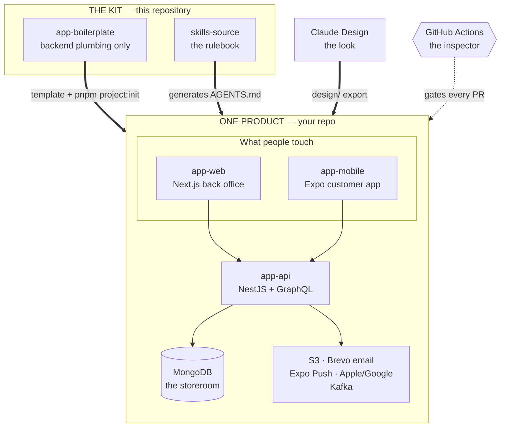

Three separate supply lines feed a product repo, and they are genuinely independent:

- **The kit** gives you working backend plumbing on day one.
- **skills-source** gives the agents their rules.
- **Claude Design** gives the product its look and scope.

The boilerplate's own UI is scaffolding. It gets discarded — design wins on look, always.

---

## 2. Day one — from kit to running branch

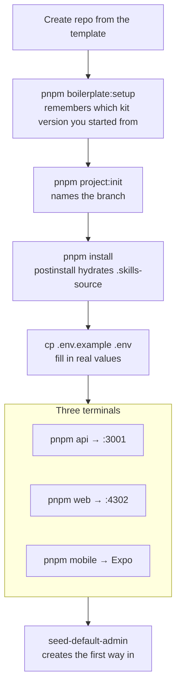

`pnpm project:init` is the one people skip and regret. It renames the display name,
slug, package scope, mobile bundle identifier, and local database — and it deliberately
**leaves `app-web`, `app-mobile`, `app-api` alone**. Those internal names stay stable so
that future kit updates merge cleanly instead of conflicting on every path.

It is idempotent and refuses to overwrite an already-customized value without `--force`.
Preview with `--dry-run`.

_Franchise: you paint your own sign, but the walk-in fridge keeps the part number the
manufacturer gave it._

---

## 3. The runtime — one tap, end to end

This is the diagram to understand first. Everything else is detail hanging off it.

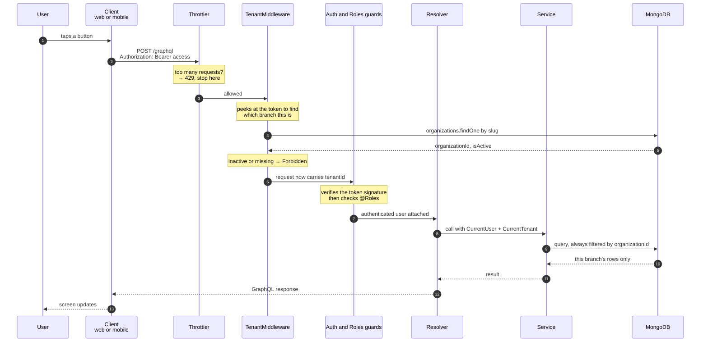

### The subtlety worth pausing on

`TenantMiddleware` calls `jwt.decode()` — it **reads the token without verifying it**.
That sounds alarming and isn't, because of the order of the pipeline:

- The middleware only uses the decoded `tenantSlug` to _look something up_. A forged token
  gets you a tenant lookup and nothing else.
- The **guard** runs afterwards and does the real cryptographic verification. A forged
  token dies there, before any resolver runs.

So the door host reads your badge to point you at the right room; the bouncer inside
checks whether the badge is real. Both, in that order.

`SUPER_ADMIN` skips tenant pinning entirely — that role works across branches by design.

**Never trust a role or tenant sent as a header.** Authorization comes from the verified
token plus current database state. That invariant is the whole reason this pipeline has
so many stages.

---

## 4. Authentication — wristbands and membership cards

Two tokens, two very different jobs.

|           | Access token           | Refresh token                |
| --------- | ---------------------- | ---------------------------- |
| Analogy   | Wristband              | Membership card              |
| Lifetime  | 15 minutes             | 30 days                      |
| Sent with | Every request          | Only the refresh call        |
| Stored    | In memory              | Client secure storage        |
| Revocable | No — just expires fast | **Yes** — delete its session |

Short-lived wristbands are what make a stolen access token boring: it dies on its own.
Long-lived cards are what make logout meaningful: the `jti` row disappears from `sessions`
and that card is instantly dead everywhere.

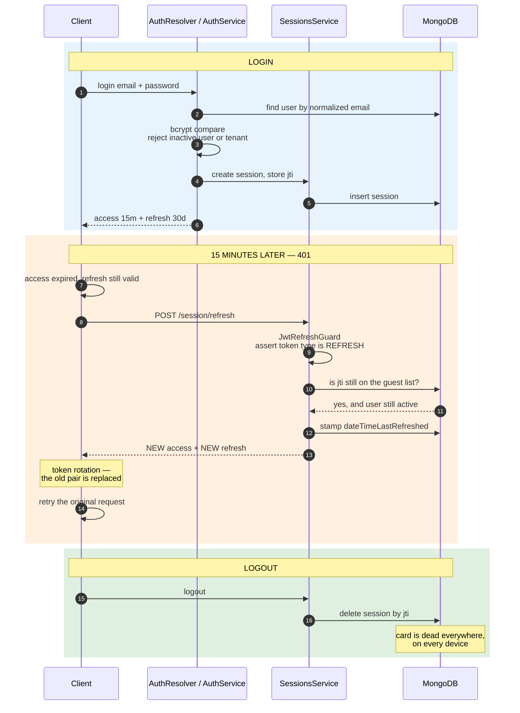

The client half of this is automatic. `react-query/graphql-client.ts` in both apps carries
a silent-refresh middleware: a 401 triggers the refresh, stores the new pair, and replays
the original request. A user never sees it.

Three roles, and they nest:

| Role          | Reach                                |
| ------------- | ------------------------------------ |
| `USER`        | Their own stuff, inside their branch |
| `ADMIN`       | The whole branch                     |
| `SUPER_ADMIN` | Every branch                         |

`@Public()` marks login and registration. Leaving `@Roles()` off an operation does **not**
make it public — it means "any signed-in role." That difference bites people once.

---

## 5. Multi-tenancy — why data cannot leak sideways

One database. One set of collections. Every tenant-owned document carries an
`organizationId`, and every tenant-owned query is filtered by it.

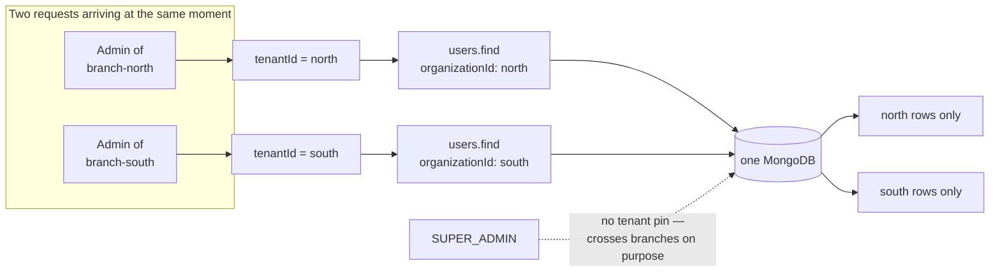

Why one shared database instead of one per branch? Cheaper, one migration, one backup,
one set of indexes. The trade is that the filter is now load-bearing: **forget
`organizationId` in one query and you have a data leak, not a bug.** That is exactly why
tenant context is resolved once at the platform boundary and handed to services through
`@CurrentTenant()`, rather than each feature rolling its own.

_Franchise: one warehouse, labelled shelves. Cheap and efficient — right up until someone
grabs from the wrong shelf._

---

## 6. What else the kitchen already does

None of this is product-specific. It ships working.

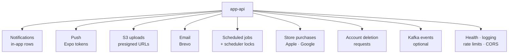

A few that deserve a sentence each:

- **Presigned S3 uploads.** The API never receives the file. It hands the client a
  time-limited URL and the client uploads straight to S3. _The kitchen gives you a locker
  key instead of carrying your bag._
- **Scheduler locks.** Run three copies of the API and a nightly job would fire three
  times. A lock row means exactly one instance wins. _One person holds the rota pen._
- **Request batch loader.** Fifty rows each needing their author would be fifty queries.
  The batcher collects them into one round trip per request. This is the classic N+1 fix.
- **Store purchases** sit behind ports and gateways, so Apple and Google are swappable
  implementations rather than logic smeared through the module.
- **Kafka** is optional. It is there for fire-and-forget work that shouldn't block a
  response, and the app runs fine without it.

### Push notifications, end to end

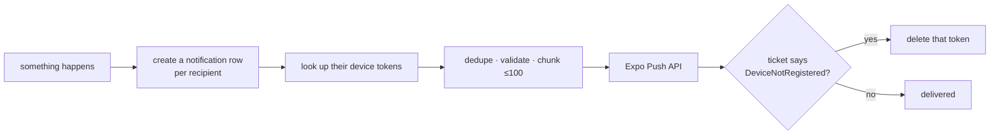

Two deliveries, one event: a row in the database so the bell icon works whether or not
the phone was on, and a push so the phone buzzes. Uninstalled apps clean themselves out
of the token table automatically.

---

## 7. The two clients

Both talk to the same GraphQL API, both use TanStack Query, both get their types
generated from the API's live schema. They differ in shell, not in approach.

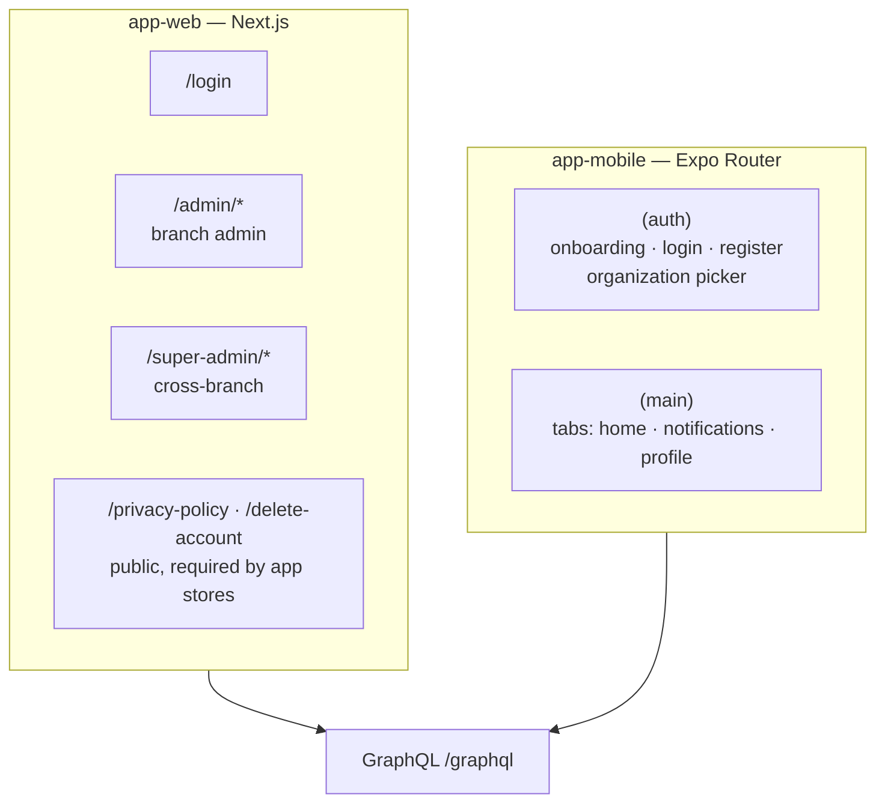

Shared client architecture in both apps: an `AuthProvider` holding the token store, a
`graphql-client` with the silent-refresh middleware, `react-query/` folders per feature,
theming, and i18n. Learn it once, it reads the same on both sides.

The public web pages are not filler — Apple and Google require a reachable privacy policy
and an account-deletion route before they will list an app.

**The type flow is worth internalizing:**

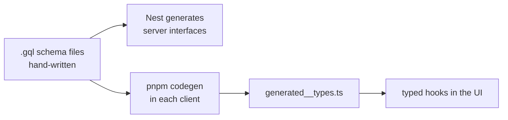

The schema is the contract. Change a `.gql` file, re-run codegen, and TypeScript points at
every screen that just broke — before anything ships. _One printed menu; kitchen and
front-of-house cannot disagree about what's on it._

---

## 8. The monorepo, and the ownership line

Nx + pnpm workspaces: one `pnpm install`, one lint/test/build command, projects that can
import each other with real type safety.

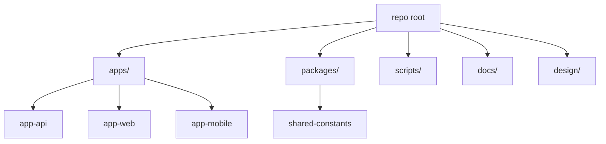

**Where does my new code go?** One question answers it: _would a completely different
product also need this?_

- Yes, and it's a genuinely shared contract or pure logic → `packages/`
- No → the owning app, under `features/` or a module

The bar for `packages/` is deliberately high. Shared code is code you can no longer change
freely.

Cutting across that is a second line, defined in `boilerplate-sync.config.json`:

|             | `foundationPaths`                                       | `productPaths`                          |
| ----------- | ------------------------------------------------------- | --------------------------------------- |
| Contains    | Auth, common, providers, react-query, scripts, packages | Your features, screens, product modules |
| Belongs to  | The kit                                                 | Your branch                             |
| Kit updates | Flow into it                                            | Never touch it                          |

Edit foundation code in a product and you've customized the walk-in fridge — every future
kit update now conflicts. `pnpm boilerplate:contributions` flags exactly that, so you
can push the improvement back up to the kit instead.

---

## 9. Where the agents' rules come from

The agents on this project don't improvise conventions. They read a generated file, and
that file is pinned to an exact upstream revision.

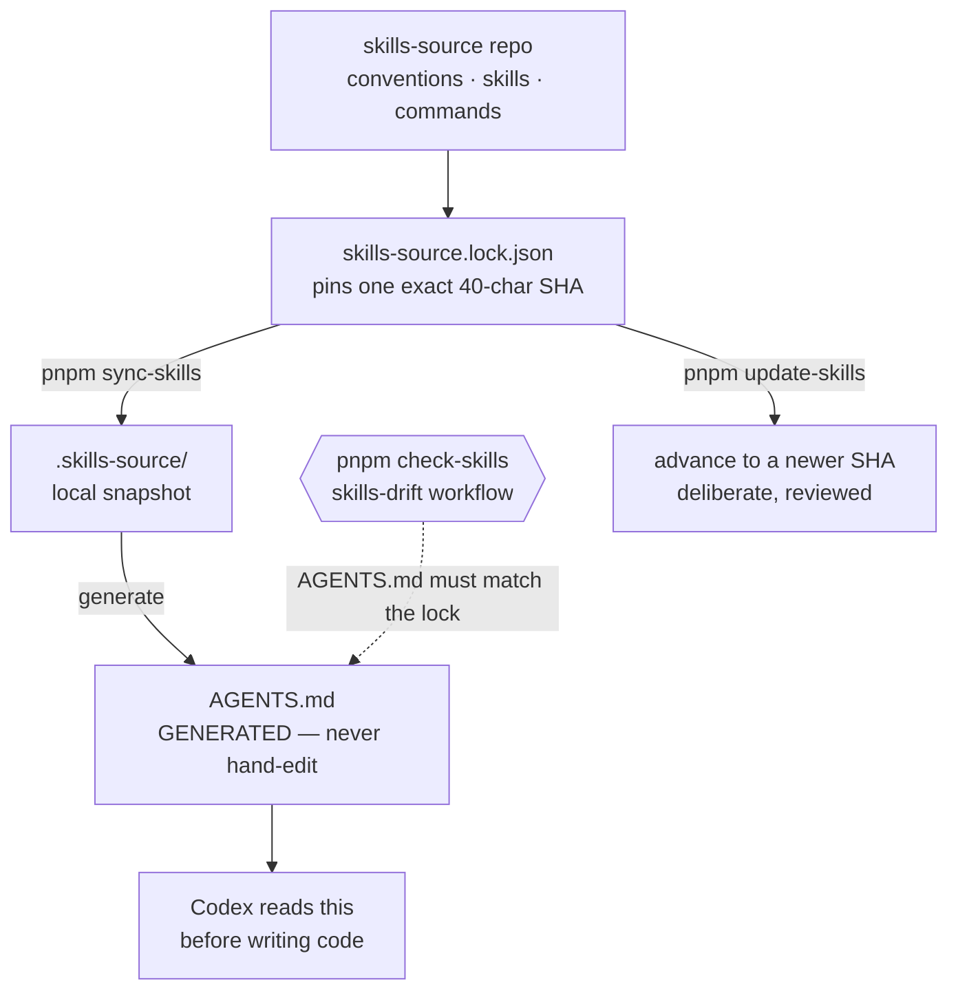

| Command              | What it does                                                 |
| -------------------- | ------------------------------------------------------------ |
| `pnpm install`       | Hydrates the **locked** snapshot only. Never moves the lock. |
| `pnpm sync-skills`   | Hydrate the locked revision, regenerate `AGENTS.md`.         |
| `pnpm update-skills` | Deliberately move the lock forward. A reviewable change.     |
| `pnpm check-skills`  | Fail if the committed `AGENTS.md` drifted. CI runs this.     |

The pin is the point. Two developers and three agents on the same commit read byte-identical
rules, and rules only change when somebody chooses to change them.

**So when a convention is wrong, you fix it upstream in `skills-source`, advance the lock,
and regenerate.** Patching `AGENTS.md` locally fixes one branch and CI reverts you.
`/capture-project-learning` is the paved road for that: it writes a reviewable proposal,
and once merged a workflow forwards it to `skills-source` as a review issue.

_Franchise: when the same mistake happens at three branches, you change the head-office
rulebook — not the sticky note in one kitchen._

---

## 10. Kit updates, in both directions

Two repos, four memory files, and a deliberately manual middle.

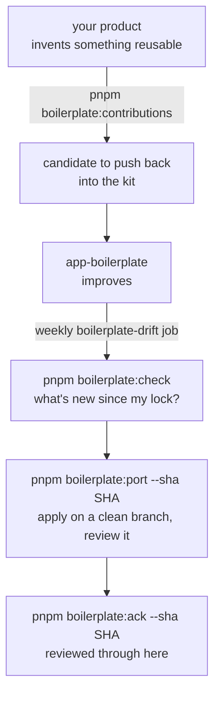

Nothing auto-merges. Updates are proposed, applied on a branch, and acknowledged only once
every commit through that SHA was applied **or deliberately declined**. That last clause
matters: declining is a valid, recorded outcome.

### The four memory files

Confusing them is the most common source of "why is this failing?"

| File                           | Written by                           | Answers                                                 |
| ------------------------------ | ------------------------------------ | ------------------------------------------------------- |
| `skills-source.lock.json`      | You, via `update-skills`             | Which rulebook revision are we on?                      |
| `boilerplate.lock.json`        | You, via `boilerplate:ack`           | Which kit updates have we reviewed?                     |
| `design/design-release.json`   | **Claude Design**                    | What is being delivered in this batch?                  |
| `design/design-sync.lock.json` | **The repository**, via `design:ack` | What have we already accepted, and what did it hash to? |

The last pair is a delivery note and a signed receipt. Claude Design writes the note; the
repository writes the receipt. **Claude Design must never touch the receipt** — that
separation is what makes the design gate meaningful.

---

## 11. The design pipeline, in brief

Full detail lives in [`docs/claude-design-flow.md`](claude-design-flow.md). The shape:

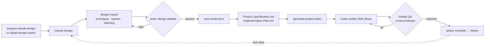

Four things a beginner should take from it:

1. **You do not wait for the full design.** Batch 1 unblocks a slice; building starts.
   `/finalize-build-docs` is the closing gate, not the starting one.
2. **Only what's inside `data-app-root` is binding.** Phone frames and annotations are
   presentation, not product.
3. **Mobile prototypes are HTML, but the app is not.** They're a contract on _outcomes_.
   You rebuild with native React Native primitives — never a WebView, never copied CSS.
4. **The gate remembers.** Every accepted prototype is hashed. Quietly editing an
   already-built screen fails validation instead of silently changing the contract.

When sources disagree: prototypes → design system → planning → repo conventions (code
structure only) → boilerplate UI, which never wins.

---

## 12. What stops a bad change

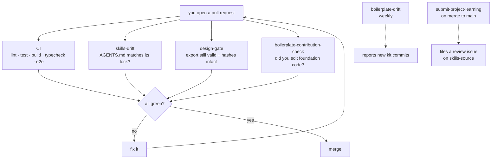

`design-gate` no-ops in a repo that has no design export yet, so the kit itself stays green.

---

## 13. Who does what

| Actor             | Does                                                  | Never does                      |
| ----------------- | ----------------------------------------------------- | ------------------------------- |
| **Claude Design** | Screens, design system, `design-release.json`         | Write `design-sync.lock.json`   |
| **Claude Code**   | Plans, reconciles, reviews, Fidelity QA, syncs Notion | Implement features unless asked |
| **Codex**         | Builds one phase, ticks `[ ] → [~] → [x]`             | Edit Notion                     |
| **You**           | Decide scope, review, approve lock advances           | Hand-edit `AGENTS.md`           |

Notion is the wall board: read by everyone, written only during planning and review.

---

## 14. Beginner mistakes, ranked by how much time they cost

1. **Skipping `pnpm project:init`** and hand-renaming things — future kit updates
   conflict everywhere.
2. **Editing `AGENTS.md` directly.** Generated. CI reverts you. Fix upstream.
3. **Forgetting `organizationId`** in a new query. Not a bug — a data leak.
4. **Trusting a client-sent role or tenant header.** Authorization comes from the verified
   token and the database.
5. **Editing foundation paths in a product repo** instead of contributing upstream.
6. **Copying prototype DOM/CSS into the mobile app.** Rebuild with native primitives.
7. **Running the design workflow in the boilerplate repo** instead of the product repo.
8. **Letting Claude Design write `design-sync.lock.json`.** Repository-owned.
9. **Waiting for the complete design before building anything.**
10. **Pasting a connection string** into design or planning docs. Environment variable
    _name_ and sanitized database name only — never a credential.

---

## 15. Glossary

| Term                       | Meaning                                                                 |
| -------------------------- | ----------------------------------------------------------------------- |
| Monorepo                   | One repo holding several apps that share tooling and types.             |
| Nx                         | The task runner that builds, lints, and tests them together.            |
| Tenant / organization      | One customer's isolated slice of the shared database.                   |
| `organizationId`           | The field that isolation depends on. Never optional.                    |
| JWT                        | A signed token. Readable by anyone, forgeable by no one.                |
| `jti`                      | The refresh token's ID, stored as a session row. Delete it to revoke.   |
| Token rotation             | Refreshing returns a _new_ refresh token, retiring the old one.         |
| Guard                      | NestJS code that runs before a resolver and can reject the request.     |
| Resolver                   | The GraphQL entry point for one operation.                              |
| Service                    | Where business logic and tenant filtering live.                         |
| Repository                 | The thin layer that talks to MongoDB.                                   |
| Codegen                    | Generating TypeScript types from the GraphQL schema.                    |
| Presigned URL              | A short-lived URL letting a client upload straight to S3.               |
| N+1                        | One query per row instead of one for all of them. The batcher fixes it. |
| `data-app-root`            | The single element marking where the real screen begins. Binding.       |
| Foundation vs product path | Kit-owned code vs your code.                                            |
| Lock file                  | A recorded revision, so everyone reads the same rules.                  |

---

## The shortest version

A shared kitchen serves several branches out of one storeroom, and a strict door policy is
the only thing keeping their shelves apart. Two clients order from the same menu, printed
from a single schema. The rules the robots build by are pinned to an exact revision, so
nobody argues about conventions. Designs arrive as sealed, hashed drawings and get built
one slice at a time. An inspector checks all of it on every pull request.

## Related

- [`docs/claude-design-flow.md`](claude-design-flow.md) — the design pipeline in depth
- [`docs/NESTJS_GRAPHQL_AUTH_PIPELINE.md`](NESTJS_GRAPHQL_AUTH_PIPELINE.md) — auth specifics
- [`docs/MONGODB_REPOSITORY_AND_INDEXING.md`](MONGODB_REPOSITORY_AND_INDEXING.md) — persistence
- [`docs/SECURITY_RATE_LIMITING_CORS_HEADERS.md`](SECURITY_RATE_LIMITING_CORS_HEADERS.md) — request hardening
- [`docs/boilerplate-updates.md`](boilerplate-updates.md) — the update and contribution workflow
- [`docs/getting-started/customize.md`](getting-started/customize.md) — the day-one checklist
- `docs/*.drawio` — sequence diagrams for refresh tokens, tenancy, and push
